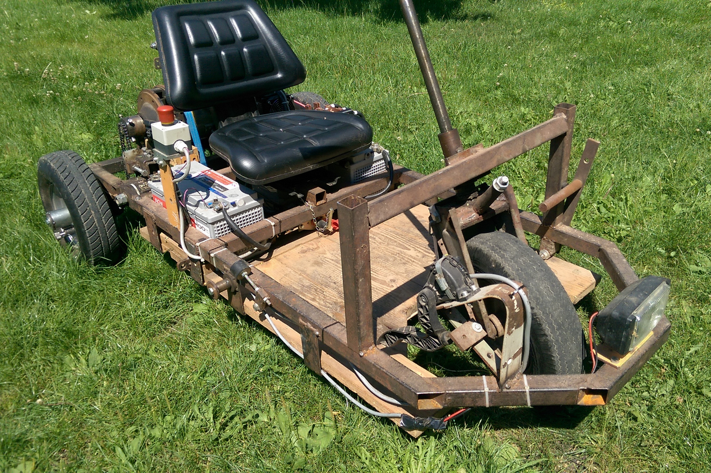
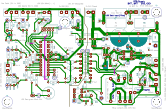
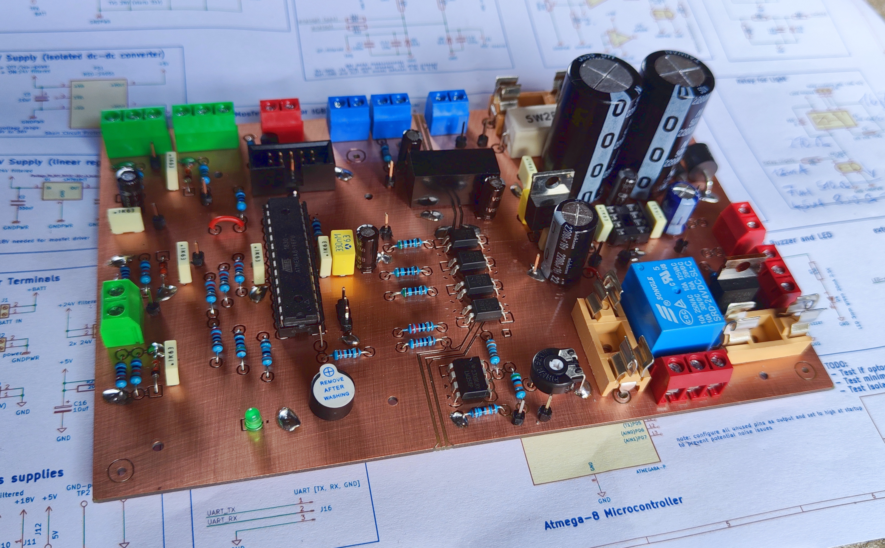
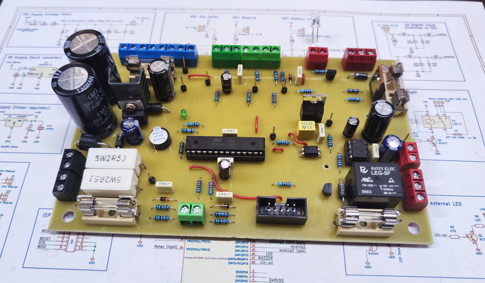
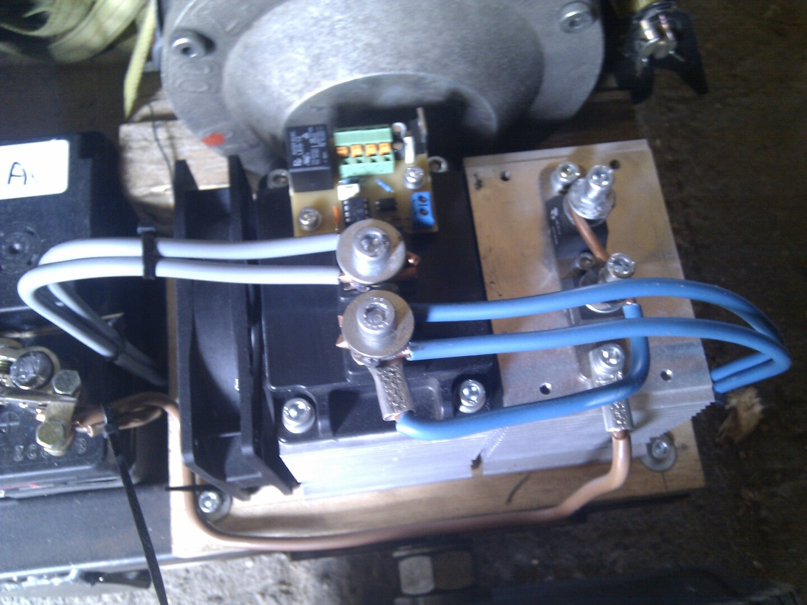

Firmware for Atmega-8 Microcontroller and kicad PCB-Files for a custom built electric kart.  
**Note:** The firmware and PCB files Version V1 were originally created in 2015, those have been added to this repository for archival purposes.

<br>

# Hardware Overview (vehicle)
- 2.9 kW Series wound motor (forklift)
- Custom pcb with Atmega-8 creating 124 Hz PWM
- Custom pcb with mosfet driver
- Custom pcb with relay on IGBT for emergency stop
- Audi gas pedal used as voltage divider 
- 600A IGBT (FUJI 1MBI600PX-140-01)
- Schottky diode

## Wiring plan
[doc/wiring-plan.drawio.pdf](doc/wiring-plan.drawio.pdf)
  
## Photos
<p align="center">
  
  
</p>


<br>

# Firmware
## Requirements
- avr-gcc
- avrdude
- make

## Compile
```bash
cd firmware/V1_fw-control-board
make
```

## Flash
Connect laptop to the board using an USB ISB-Programmer and run the commands:
```bash
make &&
sudo make upload
```
Note: `make upload` flashes the last compiled .elf file only  
-> also run `make` first for compiling and flashing the latest version.

## Current version
The current actually used project is located in [firmware/V2.1/](firmware/V2.1/).  
All other folders in [firmware/](firmware/) are for old board versions thus no longer used and archive only.


<br>

# Hardware (PCB Versions)
## V2.1
Rework of version V2.0 with more effort put into EMC to fix controller resets:
- 2 layer board
- 5V/GND for controller completely isolated from main batteries
  - isolated 5V DC-DC converter IC
  - more optocouplers: for driver, mosfet, relay and batt-voltage-threshold
- Strictly separate 5V and 24V components (separate GND planes, isolation gap)
- Front side is GND layer, Back side also has GND zones

Date: 2024.08.20  
Folder: [hardware/V2.1_board-ecar_isolated](hardware/V2.1_board-ecar_isolated/)  
Schematic: [hardware/V2.1_board-ecar_isolated/export/schematic.pdf](hardware/V2.1_board-ecar_isolated/export/schematic.pdf)
<br>
<br>
<p align="center">


</p>
<p align="center">


</p>


## V2.0
V1.1 worked well for almost 9 years, the idea was to replace the corroded pcb and get rid of the separate supply batteries for the control board.  
Single board with controller, driver and newly added:
- supply filter
- buck converter
- relay  
  
Date: 2024.08.06  
Folder: [hardware/V2.0_board-ecar](hardware/V2.0_board-ecar)  
Schematic: [hardware/V2.0_board-ecar/export/schematic.pdf](hardware/V2.0_board-ecar/export/schematic.pdf)
<br>
<br>
<p align="center">


</p>

**Fail:**  
Same problems as previous versions: When main batteries are used as supply for control pcb, the controller crashes at certain duty cycle.  
When Using an isolated supply (separate battery or lab supply) there is no issue. => peaks in supply voltage were not the issue and the filter did not really help, except preventing the voltage-regulators from burning out.  
<br>
**Issues:**  
- bad GND track (driver current shifts GND level for controller)
- bad routing overall (EMC)
- UART connector missing
- GND testpin missing


## V1.1
**separate driver board**  
Same control board from V1.0 but additional separate pcb with mosfet driver.  
Date: 2015.05.24  
Folder: [hardware/V1.1_driver-board-separate](hardware/V1.1_driver-board-separate)  
Schematic: [hardware/V1.1_driver-board-separate/export/schematic.pdf](hardware/V1.1_driver-board-separate/export/schematic.pdf)
<br>
<br>
<p align="center">
  
  
</p>


## V1.0
**control board**   
Date: 2015.05.14  
Folder: [hardware/V1.x_control-board](hardware/V1.x_control-board)  
Schematic: [hardware/V1.x_control-board/export/schematic.pdf](hardware/V1.x_control-board/export/schematic.pdf)
<br>
<br>


**Issues:**
- separate battery for control supply is necessary, when using main battery controller crashes when motor starts

**driver board on IGBT**  
pcb on IGBT with mosfet driver and relay (only the relay on this board is still used in V2.1)    
Folder: [hardware/V1.0_driver-board-on-igbt](hardware/V1.0_driver-board-on-igbt)  
Schematic: [hardware/V1.0_driver-board-on-igbt/export/schematic.pdf](hardware/V1.0_driver-board-on-igbt/export/schematic.pdf)
<br>
<br>
<p align="center">

  
</p>


