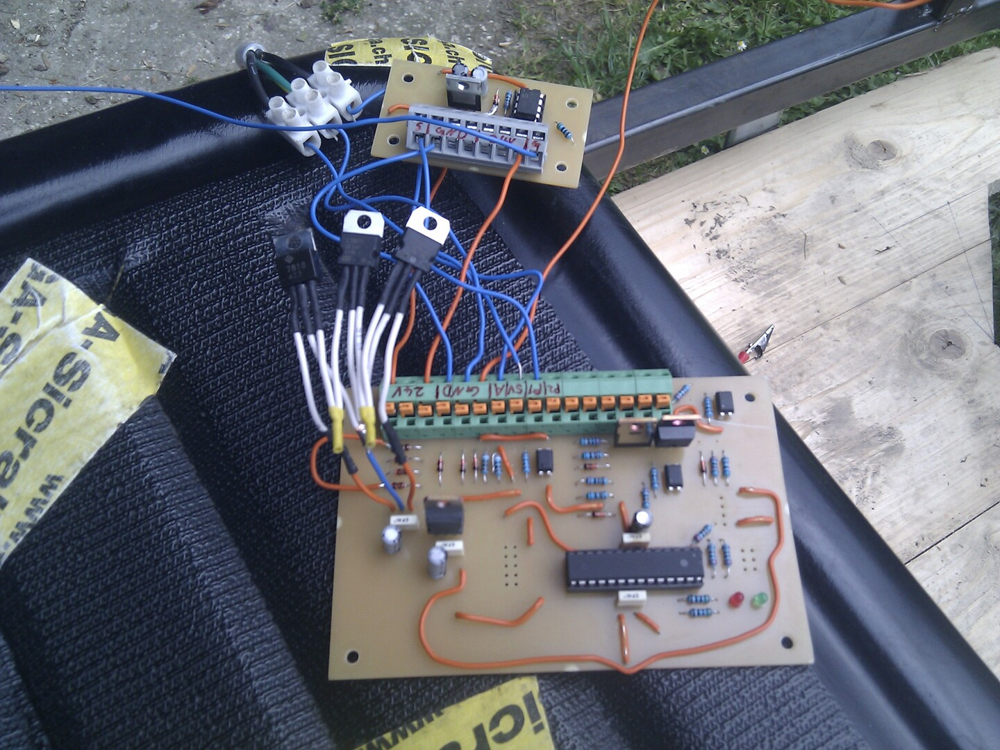
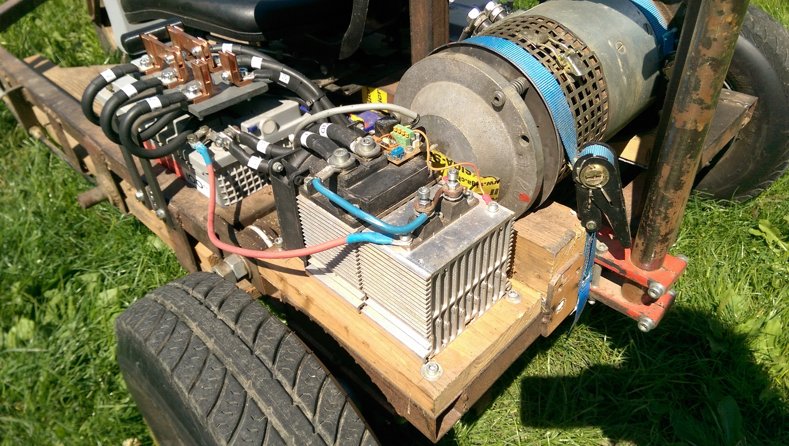
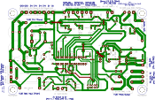
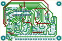
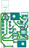

Firmware for Atmega-8 Microcontroller and kicad PCB-Files for a custom built electric kart.  
Note: V1 Firmware and PCB were created in 2015

## Hardware Overview (vehicle)
- 2.9 kW Series wound motor (forklift)
- Custom pcb with Atmega-8 creating 124 Hz PWM
- Custom pcb with mosfet driver
- Custom pcb with relay for emergency stop on IGBT
- Audi gas pedal used as voltage divider 
- 600A IGBT (FUJI 1MBI600PX-140-01)
- Schottky diode
  
### Photos

  
  

# PCB Versions
## V2.1
Single board with supply filter and isolated 5V supply  
WIP

## V2.0
V1.1 worked for almost 9 years, the idea was to replace the corroded pcb and get rid of the separate supply batteries for the control board.  
Single board with controller, driver and newly added supply filter, buck converter and relay.  
Folder: [hardware/V2.0_board-ecar](hardware/V2.0_board-ecar)
 

**Fail:**
Same problems as previous versions: When main batteries are used as supply for control pcb, the controller crashes at certain duty cycle. Using an isolated supply (separate battery or lab supply) there is no issue. => peaks in supply voltage were not the issue and the filter did not help.

## V1.1
**separate driver board**  
Same control board from V1.0 but additional pcb with mosfet driver.  
Folder: [hardware/V1.1_driver-board-separate](hardware/V1.1_driver-board-separate)
 

## V1.0
**control board**   
Folder: [hardware/V1.x_control-board](hardware/V1.x_control-board)
 

**driver board on IGBT**  
pcb on IGBT with mosfet driver and relay (only relay on this board still used in V2.1)    
Folder: [hardware/V1.0_driver-board-on-igbt](hardware/V1.0_driver-board-on-igbt)
 

